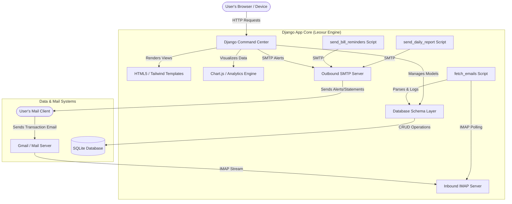

# Leoxur Income & Expense Tracker

A futuristic, highly interactive, and elegant web application designed to track financial telemetry (Ledger logs, Budget allowances, Bill reminders, and Exchange rates) with real-time dynamic visualizations. The core philosophy of this project is inspired by Python: the codebase remains lightweight, boilerplate-free, and feels like it "just works" out-of-the-box.

---

## 🚀 Quick Start Guide

### 1. Setup Environment & Install Dependencies
Ensure you have Python 3 and pip installed. Run the following commands in the project root:
```bash
# Install core dependencies
pip3 install django openpyxl reportlab
```

### 2. Database Migrations
Initialize the SQLite database schema:
```bash
python3 manage.py makemigrations
python3 manage.py migrate
```

### 3. Create Superuser (Admin Access)
Since the standard `python` command is often unassigned on macOS, use **`python3`** to run the createsuperuser wizard:
```bash
python3 manage.py createsuperuser
```
Alternatively, we have pre-configured a programmatic superuser for you:
* **Username:** `superuser`
* **Password:** `adminpass123`
* **Email:** `admin@example.com`

### 4. Configure Environment Variables (Security)
To enable automated budget breach emails, daily digests, and incoming mail transaction synchronization, export your email credentials in your terminal session before launching the server:
```bash
# Outgoing Mail (SMTP)
export EMAIL_HOST_USER="your-email@gmail.com"
export EMAIL_HOST_PASSWORD="your-google-app-password"

# Incoming Mail (IMAP)
export IMAP_USER="your-email@gmail.com"
export IMAP_PASSWORD="your-google-app-password"
```
*Note: If these are not exported, the application defaults to local-only mode, and outbound/inbound mail features will run in dry-run mode.*

### 5. Run Development Server
```bash
python3 manage.py runserver
```
Visit the application at `http://127.0.0.1:8000/` and sign in.

---

## 📐 Architecture & Telemetry Flow Diagram



---

## 🛠️ Technology Stack
* **Backend Framework:** Django (Python)
* **Database Layer:** SQLite (embedded, zero-configuration)
* **Frontend Design:** HTML5, CSS3, Tailwind CSS (sleek glassmorphic theme)
* **Interactive Elements:** Lucide Icons (vector UI glyphs), Vanilla JavaScript
* **Data Visualization:** Chart.js (animated responsive charts)
* **Reporting Engines:** `openpyxl` (Excel spreadsheets) and `reportlab` (PDF rendering)

---

## 📂 Code-by-Code Explanation

This section breaks down the application component-by-component, explaining the architectural logic behind every file.

---

### 1. Database Schema & Architecture (`tracker/models.py`)
This file defines the application's data layer using Django's ORM models.

```python
class Profile(models.Model):
    user = models.OneToOneField(User, on_delete=models.CASCADE, related_name='profile')
    theme = models.CharField(max_length=10, choices=[('light', 'Light'), ('dark', 'Dark')], default='dark')
    currency = models.CharField(max_length=5, choices=[...], default='$')
```
* **Explanation:** Extends Django's built-in `User` model to persist customizable UI preferences (such as Light/Dark mode and current functional Currency symbol: `$`, `€`, `₹`, `£`).
* **Signals:** A `post_save` Django signal automatically creates a `Profile` instance whenever a new `User` joins, ensuring instant customization availability.

```python
class Category(models.Model):
    user = models.ForeignKey(User, on_delete=models.CASCADE, related_name='categories')
    name = models.CharField(max_length=50)
    is_income = models.BooleanField(default=False)
```
* **Explanation:** Manages custom categories. Each category belongs to a specific user and is classified either as an Income category (inflow) or an Expense category (outflow).
* **Seeding Logic:** On profile registration, a signal automatically seeds 9 standard categories (`Salary`, `Freelance`, `Investment`, `Food`, `Rent`, `Utilities`, `Entertainment`, `Travel`, `Other`) to the user's ledger so the dashboard works instantly.

```python
class Transaction(models.Model):
    user = models.ForeignKey(User, on_delete=models.CASCADE, related_name='transactions')
    amount = models.DecimalField(max_digits=12, decimal_places=2)
    transaction_type = models.CharField(max_length=3, choices=[('IN', 'Income'), ('OUT', 'Expense')])
    category = models.CharField(max_length=50)
    date = models.DateField()
    description = models.CharField(max_length=255, blank=True)
```
* **Explanation:** Stores transactional ledger records. By omitting strict model-level choice validations on `category`, this field natively accepts any custom string name created dynamically by the user.

```python
class Budget(models.Model):
    user = models.ForeignKey(User, on_delete=models.CASCADE, related_name='budgets')
    category = models.CharField(max_length=50)
    amount = models.DecimalField(max_digits=12, decimal_places=2)
    period = models.CharField(max_length=10, choices=[('MONTHLY', 'Monthly'), ('YEARLY', 'Yearly')], default='MONTHLY')
    month = models.IntegerField(null=True, blank=True)
    year = models.IntegerField()
```
* **Explanation:** Models overall and category-specific budget limits for a given month and year. Tracks allowance amount against logged expenses.

```python
class Reminder(models.Model):
    user = models.ForeignKey(User, on_delete=models.CASCADE, related_name='reminders')
    title = models.CharField(max_length=100)
    amount = models.DecimalField(max_digits=12, decimal_places=2)
    due_date = models.DateField()
    is_recurring = models.BooleanField(default=False)
    recurrence_period = models.CharField(max_length=10, choices=[('DAILY', 'Daily'), ...], blank=True, null=True)
    is_paid = models.BooleanField(default=False)
```
* **Explanation:** Houses calendar events for unpaid bill schedules. Supports recurrence frequencies which are automatically evaluated when a user marks a bill as "Settled".

---

### 2. View Actions & Controllers (`tracker/views.py`)
This file coordinates application state updates, calculations, and content generation.

#### A. The Main Core Controller (`dashboard_view`)
* **Dynamic Seeding Fallback:** Checks if the logged-in user lacks categories (e.g. legacy migrated accounts) and provisions default category nodes automatically.
* **Monthly Calculations:** Dynamically queries transactions for the current calendar month and calculates total inflows, total outflows, and net savings.
* **Budget Tracking:** Looks up the user's active budgets. For each budget category, it calculates the percentage spent. If it exceeds $80\%$, it appends a Warning alert; if it matches/breaches $100\%$, it displays a Critical alert.
* **Context Payload:** Bundles ledger records, limits, alerts, user preference profile variables, and categories to render the main template.

#### B. The Conversion Rates Engine (`update_currency`)
* **Explanation:** Receives target currency (e.g., `₹`) and a user-provided conversion rate (e.g., `83.5`) via POST. Dynamically loops over **all** transactions, budgets, and bill reminders, scaling their decimal values by the exchange rate before saving, ensuring all legacy financial history accurately transforms into the new denomination.

#### C. Ledger & Reminder Modifiers
* **`add_category`:** Processes custom flow tag creation (Inflow/Outflow).
* **`edit_transaction`:** Pre-fetches an entry by primary key, updates fields dynamically, and commits back to SQLite.
* **`delete_transaction_bulk`:** Receives a comma-separated array string of ID integers (e.g., `"1,4,7"`) from the checkbox selection UI, deleting multiple transaction rows in a single batch query.
* **`edit_reminder` / `delete_reminder`:** Facilitates modifications for scheduled bill alarms.

#### D. Document Exporter Framework
* **CSV (`export_csv_view`):** Compiles financial ledger records, active budgets, and bill schedules into comma-separated text using python's built-in `csv` engine.
* **Excel (`export_excel_view`):** Spawns a multi-sheet spreadsheet workbook utilizing `openpyxl`, separation-categorizing transactions, targets, and reminders into tabbed worksheets.
* **PDF Report (`export_pdf_view`):** Builds a print-ready document using `reportlab`. Defines page geometry rules, typographic stylesheets, canvas grids, dynamic currency values, and generates tables with alternating row styling.

---

### 3. URL Router Mappings (`tracker/urls.py`)
Maps incoming browser paths directly to their Python controller views:

* `/` (Home) $\rightarrow$ `dashboard_view`
* `/signup/` & `/login/` & `/logout/` $\rightarrow$ Auth endpoints
* `/settings/update-currency/` $\rightarrow$ Denomination rate scaling controller
* `/transaction/add/` $\rightarrow$ Creates new ledger items
* `/transaction/edit/<id>/` $\rightarrow$ Modify existing transactions
* `/transaction/delete-bulk/` $\rightarrow$ Delete selected ledger records
* `/category/add/` $\rightarrow$ Deploy custom category rules
* `/reminder/edit/<id>/` & `/reminder/delete/<id>/` $\rightarrow$ Modify bill alerts
* `/export/csv/` | `/export/excel/` | `/export/pdf/` $\rightarrow$ Attachment delivery endpoints
* `/api/analytics-data/` $\rightarrow$ Serialized data API feeding Chart.js graphs

---

### 4. Interactive Frontend Template (`tracker/templates/tracker/dashboard.html`)
Combines aesthetic user experience patterns with real-time UI manipulation scripts.

#### A. Visual Interface Design
* **Glassmorphic Layout:** Employs dark-mode backgrounds, semi-transparent layout containers (`glass-panel`), blurred drop-shadow borders (`backdrop-blur`), and vibrant colored neon accents.
* **Interactive Modals:** Dynamic panels (Add/Edit Transaction, Edit Reminder, Setup Budget, Create Category) that toggle visibility.

#### B. Client-side JavaScript Engines
* **Browser Workaround for Form Nesting:** Standard HTML specifications prohibit putting forms directly inside `<tr>` or `<td>` tags, which causes Google Chrome to close them prematurely. To resolve this, this project routes click buttons to custom JS handlers:
  ```javascript
  function triggerDeleteTransaction(id) {
      if (confirm("Confirm deletion of this transaction record?")) {
          const form = document.getElementById('delete-tx-form');
          form.action = `/transaction/delete/${id}/`;
          form.submit();
      }
  }
  ```
  This submits actions via a single global hidden form located at the base of the page, ensuring flawless operational stability in Google Chrome, Safari, and Firefox.
* **Interactive Category Filtering:** The transaction modals filter category choices dynamically on type select change. When the user changes flow type between "Outflow" and "Inflow", JS updates the available dropdown options dynamically using seeded arrays (`incomeCategories` and `expenseCategories`), eliminating category entry errors.
* **Bulk Checkbox Engine:**
  - `toggleSelectAllTransactions`: Toggles every table row's checkbox state matching the header selector.
  - `updateBulkDeleteButton`: Detects selected rows, displays the floating "Delete Selected" badge, and counts the selection.
  - `submitBulkDelete`: Collects the verified array of IDs and submits them to the backend controller.

---

### 5. Email Automation & Integrations (SMTP & IMAP)
Leoxur supports real-time email-based interactions for both outgoing alerts and incoming transaction registrations.

#### A. SMTP Configurations (settings.py)
To configure outgoing mail for budget breach alerts:
1. Open [settings.py](file:///Users/hariprasathm/VirtualBox VMs/Income Tracker/income_tracker/settings.py).
2. Set your SMTP provider credentials under the `EMAIL_HOST`, `EMAIL_PORT`, `EMAIL_HOST_USER`, and `EMAIL_HOST_PASSWORD` settings. (If using Gmail, configure a Google Account App Password).
3. If an expense triggers a category budget or overall monthly budget breach, an automated warning message is instantly emailed to the user's email address.

#### B. IMAP Email-to-Ledger Parser (management/commands/fetch_emails.py)
You can log transaction entries in the app simply by sending an email from your registered user account email:
1. Configure your IMAP inbox settings in [settings.py](file:///Users/hariprasathm/VirtualBox VMs/Income Tracker/income_tracker/settings.py) (e.g. `imap.gmail.com`).
2. Compose a new mail to your inbox.
3. In either the **Subject** or **Body** line, write your transaction using the comma-separated format:
   `Category, Amount, Flow_Type, Description`
   * *Example 1 (Expense):* `Food, 25.50, OUT, Lunch at local diner`
   * *Example 2 (Income):* `Salary, 3500.00, IN, Monthly Salary payout`
4. Run the synchronization command in your terminal:
   ```bash
   python3 manage.py fetch_emails
   ```
5. The automation engine will securely:
   - Connect to the inbox.
   - Filter unread messages.
   - Match the sender against your registered user database account (security validation).
   - Parse the transaction values.
   - Automatically log the new entry to the database.
   - Send a confirmation email acknowledging the success of the log (or an instructions email if the format could not be parsed).
   - Mark the processed email as read (`Seen`).

#### C. Daily Automated Reports (`tracker/management/commands/send_daily_report.py`)
To dispatch a comprehensive email report to all active registered users containing transaction values, active budget levels, and attached statements:
1. Run the daily dispatcher command in your terminal:
   ```bash
   python3 manage.py send_daily_report
   ```
2. The automation engine will:
   - Calculate month-to-date inflows, outflows, and net balances.
   - Summarize active budget targets (and check for breach statuses).
   - Generate the complete ReportLab PDF statement in memory.
   - Generate the OpenPyXL Excel spreadsheet in memory.
   - Dispatch an email to the user attaching both files (e.g. `Statement_YYYYMMDD.pdf`, `Statement_YYYYMMDD.xlsx`).
3. You can set this command up on a server cron schedule (e.g. executing once daily at midnight) to receive your reports automatically.

#### D. Daily Bill Reminder Email Alerts (`tracker/management/commands/send_bill_reminders.py`)
To scan the ledger and send automated notification email alerts for unpaid bills due on the current day:
1. Run the reminders dispatcher command in your terminal:
   ```bash
   python3 manage.py send_bill_reminders
   ```
2. The automation engine will:
   - Identify all active (unpaid) reminders due today.
   - For each matching reminder, email the respective user (using their customized SMTP settings if configured).
3. We recommend running this command daily on a server cron task alongside the daily reports to ensure timely alerts.
